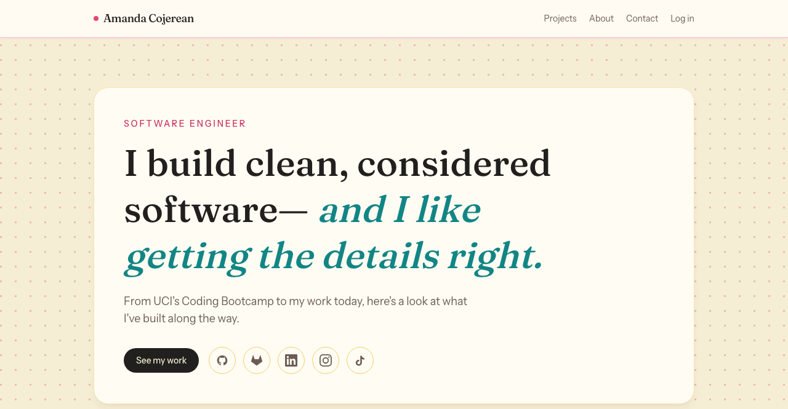

# Amanda Cojerean — Portfolio

A personal portfolio site built to showcase projects from UCI's Coding Bootcamp, solo work, and beyond.

**Live site:** coming soon

## Features

- **Project showcase** — cards pulled from a seeded `Project` model, each with a title, tagline, tech stack, and links to the live demo or source
- **Contact form** — name, company, phone, email, reason for contact, and message, delivered straight to my inbox with reply-to set to the sender
- **Spam protection** — a honeypot field and a submission-time check block bots by default, with optional Cloudflare Turnstile verification that activates automatically once configured
- **Fully responsive** — a collapsing hamburger menu on smaller screens, fluid layouts throughout
- **A color palette with personality** — warm cream, hot pink, teal, and mustard, because portfolios don't have to be black and white

## Built with

- [Laravel](https://laravel.com) — application framework
- [Livewire](https://livewire.laravel.com) — the contact form and interactive pieces, no separate JS framework required
- [Flux](https://fluxui.dev) — UI components for the authenticated areas (profile, security settings)
- [Tailwind CSS](https://tailwindcss.com) — styling
- [Fortify](https://laravel.com/docs/fortify) — authentication scaffolding
- SQLite — lightweight storage for project data

## Sections

- **Hero** — a quick introduction and links to GitHub, GitLab, LinkedIn, Instagram, and TikTok
- **Projects** — a mix of team builds from UCI's Coding Bootcamp and independent projects
- **About** — a short bio
- **Contact** — the form described above

## Connect

- GitHub: [@acerjak](https://github.com/acerjak)
- GitLab: [@acerjak](https://gitlab.com/acerjak)
- LinkedIn: [in/acerjak](https://www.linkedin.com/in/acerjak/)
- Instagram: [@yourcraftyboo](https://www.instagram.com/yourcraftyboo/)
- TikTok: [@AmandaCojerean](https://www.tiktok.com/@amandacojerean)
